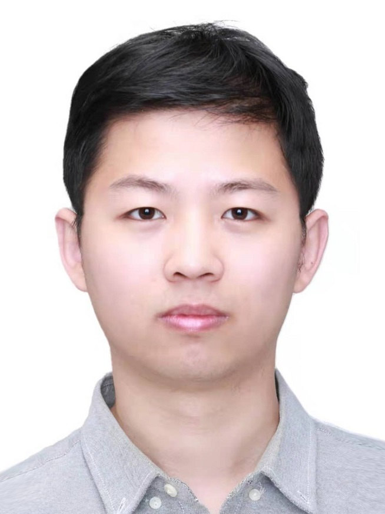

<h2>Abstract</h2>

Generic multi-threaded sampled simulation has been a long-standing, challenging problem with the potential to help change how researchers study modern, complex computing systems. Yet, a practical solution for reducing complex multi-threaded applications into a representative sample has been elusive. Existing techniques either do not provide significant speedups to be useful or are limited to be applicable only to certain synchronization types. In addition, workload-specific solutions can be rigid with respect to region selection, which can limit the overall simulation speedup when the selected regions are large. A solution is needed that both supports generic multi-threaded applications, no matter the synchronization primitives used, as well as allows for ease of deployment and fast evaluation.

To solve these challenges, we propose a novel sampling technique for multi-threaded applications, called LoopPoint, that is both agnostic to the type of synchronization primitives used and scales by the similarity exhibited by the application. The proposed methodology combines several vital features, including (1) repeatable, up-front application analysis, (2) a novel clustering approach to take into account run-time parallelism, (3) the use of loop-based simulation markers to divide the work into measurable chunks, even in the presence of spin-loops, and (4) the non-deterministic simulation of ELFie checkpoints generated using the loop-based markers. LoopPoint identifies representative simulation regions that can be simulated in parallel to achieve speedups of up to 801× for the train input set of the multi-threaded SPEC CPU2017 benchmarks with an average simulation error of just 2.3%.

<h2>Video</h2>
The short talk on LoopPoint at HPCA 2022.

  <iframe width="640" height="360" src="https://www.youtube.com/embed/Tr6O9MkT42g" frameborder="0" allow="accelerometer; autoplay; encrypted-media; gyroscope; picture-in-picture" allowfullscreen></iframe>

 
The talk on ELFies at CGO 2021.

  <iframe width="640" height="360" src="https://www.youtube.com/embed/MYxhvRmVoSw" frameborder="0" allow="accelerometer; autoplay; encrypted-media; gyroscope; picture-in-picture" allowfullscreen></iframe>

<h2><b>Publications</b></h2>
[1] <a href="https://alenks.github.io/pdf/looppoint_hpca2022.pdf">LoopPoint: Checkpoint-driven Sampled Simulation for Multi-threaded Applications</a>
 
Alen Sabu, Harish Patil, Wim Heirman, and Trevor E. Carlson
 
2022 IEEE International Symposium on High-Performance Computer Architecture (HPCA)

<h5><pre><code>@inproceedings{10.1109/HPCA53966.2022.00051,
author = {Sabu, Alen and Patil, Harish and Heirman, Wim and Carlson, Trevor E.},
title = {LoopPoint: Checkpoint-driven Sampled Simulation for Multi-threaded Applications},
year = {2022},
isbn = {978-1-6654-2028-0},
publisher = {IEEE Press},
address = {New York City, NY, USA},
url = {https://doi.org/10.1109/HPCA53966.2022.00051},
doi = {10.1109/HPCA53966.2022.00051},
booktitle = {Proceedings of the 2022 IEEE International Symposium on High-Performance Computer Architecture},
articleno = {},
numpages = {15},
pages = {604-618},
keywords = {checkpointing, multi-threaded, record-and-replay, sampling, simulation},
location = {Seoul, Korea, Republic of},
series = {HPCA '22}}</code></pre></h5>

[2] <a href="https://alenks.github.io/pdf/elfie_cgo21_submitted.pdf">ELFies: Executable Region Checkpoints for Performance Analysis and Simulation</a>
 
Harish Patil, Alexander Isaev, Wim Heirman, Alen Sabu, Ali Hajiabadi, and Trevor E. Carlson
 
2021 IEEE/ACM International Symposium on Code Generation and Optimization (CGO)

<h5><pre><code>@inproceedings{10.1109/CGO51591.2021.9370340,
author = {Patil, Harish and Isaev, Alexander and Heirman, Wim and Sabu, Alen and Hajiabadi, Ali and Carlson, Trevor E.},
title = {ELFies: Executable Region Checkpoints for Performance Analysis and Simulation},
year = {2021},
isbn = {9781728186139},
publisher = {IEEE Press},
address = {New York City, NY, USA},
url = {https://doi.org/10.1109/CGO51591.2021.9370340},
doi = {10.1109/CGO51591.2021.9370340},
booktitle = {Proceedings of the 2021 IEEE/ACM International Symposium on Code Generation and Optimization},
articleno = {},
numpages = {11},
pages = {126–136},
keywords = {record and replay, dynamic program analysis, performance monitoring, simulation region selection},
location = {Virtual Event, South Korea},
series = {CGO '21}}</code></pre></h5>

<h2>The Team</h2>

LoopPoint and ELFies was done as a collaboration project between the National University of Singapore (NUS) and Intel Corporation. There are several people involved in the project both from NUS and Intel. The primary contributors of the project are listed below.

<a href="https://alenks.github.io" target="_blank"> <b>Alen Sabu</b> </a> 

Alen is a PhD candidate in computer science at the National University of Singapore. His research interests lie broadly in the areas of computer architecture, performance analysis, and distributed systems. His current research focus is on speeding up the architectural simulation of multi-threaded applications.

 

<a href="https://github.com/Changxi-Liu" target="_blank"><b> Changxi Liu</b></a> 

 Changxi Liu is a PhD student at the National University of Singapore. His research interests include simulation, compilers, high-performance computing, and computer architecture exploration. He has published papers in ICS and FGCS in the area of high-performance computing. He received a Master’s and Bachelor’s degree in computer science both from Beihang University, Beijing.

 

<a href="https://pages.cs.wisc.edu/~patil" target="_blank"><b> Harish Patil</b> </a>  

Harish Patil is a  Principal Engineer in a  Technology Path-finding and Innovation group at Intel Corporation. His areas of interest include static/dynamic program analysis (using “Pin/SDE” and “LLVM”), simulation point selection(“PinPoints”), record/replay (“PinPlay”), and debugging (“DrDebug”). Recipient of “ACM Programming Languages Software Award:2020” for co-developing the Pin program instrumentation framework. Co-author of two papers with  “Test-of-Time” awards based on Pin (PLDI 2005-2015) and  PinPlay (CGO 2010-2020). He has a Ph.D. from the University of Wisconsin, Madison, a B.Tech. and an M.Tech. from Indian Institute of Technology, Bombay, and an MBA from Babson College.

 

<a href="https://heirman.net" target="_blank"><b> Wim Heirman</b> </a> 

Wim Heirman is a research scientist at Intel Corporation. His research interests include fast and accurate simulation, and computer architecture design and exploration. He co-authored the Sniper Multi-Core Simulator, has written 100+ papers in scientific conferences and journals, and has 10 granted US patents. He received a M.Sc (2003) and Ph.D (2008) in computer engineering from Ghent University, Belgium.

 

<a href="https://www.comp.nus.edu.sg/~tcarlson/" target="_blank"><b> Trevor E. Carlson</b> </a> 

Trevor E. Carlson is an assistant professor at the National University of Singapore (NUS). He received his B.S. and M.S. degrees from Carnegie Mellon University in 2002 and 2003, his Ph.D. from Ghent University in 2014, and has worked for 3 years as a postdoctoral researcher at Uppsala University until 2017. He has over 13 years of computer architecture experience covering both industry and academia. His work on microarchitecture, simulation, sampling and modeling has seen three Best Paper Awards and three nominations for Best Paper. He has been developing techniques for high-efficiency processors that improve energy efficiency and performance by taking into account Memory Level Parallelism (MLP) together with unique architectural designs and software techniques. He co-authored the Sniper Multi-Core Simulator which has been used by hundreds of researchers to evaluate the performance and power efficiency of next-generation systems. His research interests include highly-efficient microarchitectures, hardware/software co-design, performance modeling, and fast and scalable simulation methodologies.

